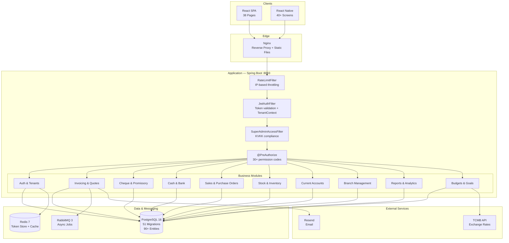
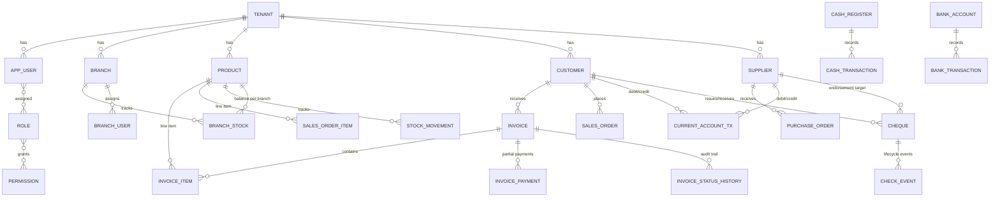

# Architecture

## System Overview

Zecrone follows a **modular monolith** architecture with clear domain boundaries. The system is designed as a single deployable unit while maintaining strict module separation, making it straightforward to extract modules into microservices when scaling demands it.

The platform consists of three client applications (web, mobile, SuperAdmin panel) communicating with a single Spring Boot backend, backed by PostgreSQL, Redis, and RabbitMQ.

## High-Level Architecture



## Backend Architecture

### Module Structure

The backend is organized into domain-driven modules under `com.financialtracker.backend`:

```
com.financialtracker.backend
├── shared/                     # Cross-cutting concerns
│   ├── BaseEntity              # Auditable base (createdAt, updatedAt, tenantId)
│   ├── PageResponse            # Standardized paginated API responses
│   ├── ApiResponseMapper       # Response formatting
│   ├── GlobalExceptionHandler  # Centralized error handling
│   ├── BusinessException       # Domain-specific exceptions
│   ├── AsyncJobService         # RabbitMQ background task processing
│   ├── ExchangeRateService     # TCMB rate sync (hourly via @Scheduled)
│   ├── EmailService            # Resend SDK email sending
│   └── ActivityLogService      # User action audit trail
│
├── api/                        # REST Controllers (38 total)
│   ├── AuthController          # Login, trial signup, token refresh, password reset
│   ├── CoreBusinessReadController   # Dashboard, transactions, invoices, quotes (JdbcTemplate)
│   ├── CoreBusinessWriteController  # Transaction CRUD, stock movements (JdbcTemplate)
│   ├── InvoiceController       # Invoice CRUD, payments, status management
│   ├── QuoteController         # Quote CRUD, convert to invoice
│   ├── CustomerController      # Customer CRM operations
│   ├── SupplierController      # Supplier management
│   ├── ProductController       # Product catalog operations
│   ├── ChequeController        # Cheque lifecycle management
│   ├── CashBankController      # Cash register & bank account operations
│   ├── CurrentAccountController # Cari hesap transactions & statements
│   ├── SalesOrderController    # Sales order processing
│   ├── PurchaseOrderController # Purchase order management
│   ├── StockController         # Stock counts, lots, alerts, warehouse locations
│   ├── BranchController        # Branch CRUD
│   ├── BranchTransferController # Inter-branch stock transfers
│   ├── ReportController        # Financial reports (P&L, cash flow, aging, etc.)
│   ├── BudgetController        # Budget management
│   ├── SalesGoalController     # Sales target tracking
│   ├── UserManagementController # Tenant user CRUD + role assignment
│   ├── RoleManagementController # Role permission configuration
│   ├── TenantController        # SuperAdmin tenant/license management
│   ├── ExchangeRateController  # TCMB rate viewing & manual sync
│   └── ... (additional controllers for tags, categories, payment methods, etc.)
│
├── domain/                     # JPA Entities (90+ total)
│   ├── Tenant                  # Multi-tenant firm (name, slug, plan, license dates)
│   ├── AppUser                 # Platform user with tenant FK
│   ├── Role / Permission       # RBAC entities
│   ├── Invoice / InvoiceItem   # Invoice with line items
│   ├── InvoicePayment          # Partial payment tracking
│   ├── InvoiceStatusHistory    # Status change audit trail
│   ├── Quote / QuoteItem       # Sales quotes
│   ├── SalesOrder / SalesOrderItem
│   ├── PurchaseOrder / PurchaseOrderItem
│   ├── PurchaseRequest / PurchaseRequestItem
│   ├── Customer / Supplier     # Business contacts
│   ├── Product / ProductCategory / ProductType
│   ├── VariantAttribute / VariantAttributeValue
│   ├── BranchStock / StockMovement / StockAlert
│   ├── StockCount / StockCountItem / ProductLot
│   ├── WarehouseLocation / Repository
│   ├── CashRegister / CashTransaction
│   ├── BankAccount / BankTransaction
│   ├── Cheque / CheckEvent / LedgerEntry
│   ├── CurrentAccountTransaction / CurrentAccountCategory
│   ├── Transaction / RecurringTransaction
│   ├── Branch / BranchUser / BranchTransfer / BranchTransferItem
│   ├── Budget / ExchangeRate / SalesGoal / FinancialGoal
│   ├── CustomerPriceList / PaymentMethod
│   ├── Tag / Brand / Currency / Category
│   ├── ReportTemplate / SavedReport
│   └── UserActivityLog
│
├── repository/                 # Spring Data JPA Repositories (42 total)
│
├── service/                    # Business Logic Services
│   ├── InvoiceService          # Invoice calculations, payment accounting, status management
│   ├── CheckService            # Cheque lifecycle, endorsement chain
│   ├── ExchangeRateService     # TCMB XML parsing, scheduled sync, caching
│   ├── EmailService            # Resend API integration
│   ├── AsyncJobService         # RabbitMQ job queue management
│   └── ActivityLogService      # Audit trail recording
│
├── security/                   # Security Infrastructure
│   ├── JwtService              # Token generation & validation (JJWT 0.12.6)
│   ├── JwtAuthenticationFilter # Request authentication + TenantContext setup
│   ├── SuperAdminAccessFilter  # KVKK compliance — blocks cross-tenant business data
│   ├── RateLimitFilter         # IP-based rate limiting
│   ├── TenantContext           # ThreadLocal<Integer> tenant isolation
│   └── TokenStoreService       # Redis-based refresh token storage
│
└── config/                     # Application Configuration
    ├── SecurityConfig          # Filter chain, CORS, endpoint rules
    ├── WebConfig               # MVC configuration
    ├── DatabaseUrlConfig       # Dynamic datasource from env vars
    └── RabbitMqConfig          # Message broker queue definitions
```

### Architectural Decisions

| Decision | Rationale |
|----------|-----------|
| **JdbcTemplate for complex queries** | Reports, dashboards, and multi-join queries use direct SQL via JdbcTemplate for performance, while simpler CRUD operations use Spring Data JPA |
| **Controller-heavy pattern** | Most business logic lives in controllers with JdbcTemplate for pragmatic speed. Dedicated services exist only for complex domains (Invoice, Cheque, ExchangeRate) |
| **Shared-schema multi-tenancy** | All tenants share the same database and tables, with tenant_id columns and TenantContext filtering. Chosen for operational simplicity over schema-per-tenant |
| **ThreadLocal for tenant context** | TenantContext uses ThreadLocal to carry tenant_id through the request lifecycle without passing it through every method signature |

## Security Architecture

### Request Pipeline

```
HTTP Request
     │
     ▼
┌─────────────────────┐
│   RateLimitFilter    │ ─── Too many requests ──► 429 Too Many Requests
│   (IP-based)         │
└──────────┬──────────┘
           ▼
┌─────────────────────┐
│  JwtAuthFilter       │ ─── Invalid/Expired ────► 401 Unauthorized
│  • Parse JWT         │
│  • Set SecurityCtx   │
│  • Set TenantContext  │
└──────────┬──────────┘
           ▼
┌─────────────────────┐
│  SuperAdminAccess    │ ─── Cross-tenant ────────► 403 KVKK_ACCESS_DENIED
│  Filter (KVKK)       │     business data
│  • SuperAdmin +      │
│    different tenant?  │
│  • Block business     │
│    endpoints          │
└──────────┬──────────┘
           ▼
┌─────────────────────┐
│  @PreAuthorize       │ ─── Missing permission ──► 403 Forbidden
│  (per endpoint)      │
└──────────┬──────────┘
           ▼
    Business Logic
    (tenant_id filtered)
```

### JWT Token Management

| Token | TTL | Storage | Purpose |
|-------|-----|---------|---------|
| **Access Token** | 15 minutes | Client (memory/localStorage) | API authentication, carries userId, username, roles[], permissions[], tenantId |
| **Refresh Token** | 7 days | Redis (TokenStoreService) | Token rotation for new access tokens |
| **Blacklisted Token** | Remaining TTL | Redis | Revoked access tokens (on logout) |
| **Password Reset Code** | 30 minutes | Redis | 6-digit code for forgot-password flow, single-use |

### KVKK Compliance Filter

The SuperAdminAccessFilter enforces Turkish data protection law (KVKK) by controlling what a SuperAdmin can access when operating on a different tenant:

**Allowed paths** (cross-tenant):
- `/api/v1/tenants` — Tenant management
- `/api/v1/admin/users` — User management
- `/api/v1/admin/roles` — Role management
- `/api/v1/auth` — Authentication
- `/api/v1/branches` — Branch structure
- `/actuator` — Health monitoring

**Blocked** (cross-tenant): All business data endpoints (invoices, customers, products, transactions, etc.)

### RBAC Implementation

```
Permission Check Flow:

  Controller Method
       │
  @PreAuthorize("hasAuthority('INVOICE_VIEW')")
       │
       ▼
  SecurityContext.getAuthentication()
       │
       ▼
  JWT claims → permissions[] array
       │
       ▼
  Contains 'INVOICE_VIEW'? ──► YES: Proceed
                             └► NO:  403 Forbidden
```

30+ granular permission codes organized by module:
- `INVOICE_VIEW`, `INVOICE_EDIT`, `CASH_VIEW`, `CASH_EDIT`
- `STOCK_VIEW`, `STOCK_EDIT`, `CUSTOMER_VIEW`, `CUSTOMER_EDIT`
- `REPORT_VIEW`, `BRANCH_VIEW`, `BRANCH_EDIT`
- `USER_MANAGE`, `ROLE_MANAGE`, `TENANT_MANAGE`
- And more across all business modules

Admins can customize which permissions each role has through the Role Management UI.

## Multi-Tenancy Strategy

```
Tenant Isolation Architecture:

  JWT Token → tenantId claim
       │
       ▼
  JwtAuthFilter
       │
       ▼
  TenantContext.setTenantId(tenantId)    ← ThreadLocal<Integer>
       │
       ▼
  Every Repository / JdbcTemplate query
       │
       ▼
  WHERE tenant_id = TenantContext.getTenantId()
       │
       ▼
  Complete data isolation per tenant
```

**SuperAdmin tenant switching:**
- SuperAdmin sends `X-Tenant-Id` header to operate on a specific tenant
- KVKK filter limits accessible data based on the target tenant
- Frontend provides `selectTenant()` in auth context for UI-level tenant switching

**Tenant lifecycle:**
```
Trial Registration → TRIAL (14 days, 5 users)
       │
       ▼ (SuperAdmin upgrades)
  STARTER (5 users) → PROFESSIONAL (15 users) → ENTERPRISE (999 users)
       │
       ▼ (License expires)
  Login blocked with informative error
       │
       ▼ (SuperAdmin extends license)
  Access restored
```

## Frontend Architecture

### Component Architecture

```
main.tsx (entry point)
    │
    ├── Unauthenticated Routes
    │   └── AuthPage (Login / Trial Registration)
    │
    └── Authenticated Routes
        └── AppLayout
            ├── Sidebar Navigation (collapsible, permission-filtered)
            ├── TopBar (user info, theme toggle, language switch, branch selector)
            └── ProtectedRoute (permission-checked lazy-loaded pages)
                │
                ├── Dashboard (KPIs, charts, budgets, alerts)
                ├── Invoices (list, create, edit, payments, print, email)
                ├── Quotes (list, create, edit, convert)
                ├── Sales Orders / Purchase Orders / Purchase Requests
                ├── Customers / Suppliers (CRM, current accounts)
                ├── Products (catalog, categories, variants)
                ├── Cash & Bank (registers, accounts, transfers)
                ├── Cheques (lifecycle, endorsement)
                ├── Stock Management (movements, counts, lots, alerts)
                ├── Branches (management, transfers)
                ├── Reports (10+ report types with date filters)
                ├── Budgets / Sales Goals
                ├── Exchange Rates / Tags / Settings
                ├── Admin Panel (users, roles, permissions)
                └── SuperAdmin Panel (tenants, licenses, platform stats)
```

### State Management

```
┌──────────────────────────────────────────────────┐
│                 TanStack Query v5                 │
│              (Server State Manager)               │
│                                                   │
│  ┌────────────────┐  ┌─────────────────────────┐  │
│  │ Query Cache    │  │ Mutation Handlers        │  │
│  │ • Auto-refetch │  │ • Optimistic updates     │  │
│  │ • Stale-while  │  │ • Cache invalidation     │  │
│  │   revalidate   │  │ • Error rollback         │  │
│  └────────────────┘  └─────────────────────────┘  │
├──────────────────────────────────────────────────┤
│               React Context (Auth)                │
│  JWT tokens, user info, tenant context,           │
│  RBAC helpers (hasRole, hasPermission)             │
├──────────────────────────────────────────────────┤
│           React Hook Form + Zod                   │
│  Form state, schema validation, error handling    │
├──────────────────────────────────────────────────┤
│       API Client (Axios Instance)                 │
│  JWT interceptors, auto token refresh,            │
│  X-Tenant-Id header injection, error handling     │
└──────────────────────────────────────────────────┘
```

### Route Protection

```
ProtectedRoute Decision Flow:

  User navigates to /invoices
       │
       ▼
  Is user authenticated? (valid JWT)
       │
       ├── NO  → Redirect to /login
       │
       └── YES → Does user have 'INVOICE_VIEW' permission?
                  │
                  ├── NO  → Redirect to /unauthorized
                  │
                  └── YES → Render InvoicesPage (lazy-loaded)
```

### i18n & Theming

| Feature | Implementation |
|---------|---------------|
| **Languages** | Turkish (TR) and English (EN) |
| **Persistence** | localStorage |
| **Theme** | Dark/Light mode via next-themes |
| **System Detection** | Auto-detects system theme preference |

## Mobile Architecture

### Navigation Structure

```
App
├── Auth Stack
│   ├── Login Screen
│   └── Register Screen
│
└── Main Tab Navigator (authenticated)
    ├── Dashboard Tab
    │   └── Dashboard Screen (KPIs, charts)
    │
    ├── Finance Tab
    │   ├── Invoices (List, Detail, Form)
    │   ├── Quotes (List, Detail, Form)
    │   ├── Cash & Bank (List, Detail, Form, Transfer)
    │   ├── Cheques (List, Detail, Form)
    │   ├── Transactions (List, Form, Recurring)
    │   └── Exchange Rates
    │
    ├── Business Tab
    │   ├── Customers (List, Detail, Form)
    │   ├── Suppliers (List, Detail, Form)
    │   ├── Sales Orders (List, Detail, Form)
    │   └── Purchase Orders (List, Detail, Form)
    │
    ├── Inventory Tab
    │   ├── Products (List, Detail, Form, Variants)
    │   ├── Stock Movements
    │   ├── Stock Counts
    │   ├── Stock Lots
    │   ├── Warehouse Locations
    │   └── Branches (List, Transfer)
    │
    └── More Tab
        ├── Reports (List, Detail)
        ├── Budgets / Sales Goals / Financial Goals
        ├── Tags / Notifications
        ├── Settings / User Management / Role Management
        └── Logout
```

### Offline Architecture

```
Online Mode:
  Screen → Axios API Call → Backend → Response → UI Update

Offline Mode:
  Screen → SQLite Local DB → UI Update
       └→ SyncQueue (Zustand) → Queued Operation
                                      │
                                      ▼ (network restored)
                               Sync Engine
                               • Replays queued operations
                               • Resolves conflicts
                               • Updates local DB from server
```

**Offline-capable models:**
| Model | Purpose |
|-------|---------|
| `CustomerModel` | Customer data for offline access |
| `ProductModel` | Product catalog for offline browsing |
| `DraftInvoiceModel` | Create invoices while offline |
| `SyncQueueModel` | Queue operations for later sync |

**State persistence:** Zustand stores with MMKV (encrypted key-value storage) for auth tokens and app state that survives app restarts.

## Database Architecture

### Migration History

51 Flyway migrations (V1 through V51) covering:

| Phase | Migrations | Scope |
|-------|-----------|-------|
| **Foundation** | V1-V10 | Users, auth, products, basic transactions |
| **Financial** | V11-V20 | Invoices, quotes, cheques, cash/bank, current accounts |
| **Commercial** | V21-V30 | Sales orders, purchase orders, stock management |
| **Advanced** | V31-V40 | Reports, budgets, variants, lots, warehouse locations |
| **Multi-Tenancy** | V41-V51 | Tenant infrastructure, tenant_id columns, RBAC expansion, SuperAdmin, licensing |

### Entity Relationship Overview



### Key Indexing Strategy

All business tables are indexed on `tenant_id` as the primary filter. Additional indexes exist on:
- `customer_id`, `supplier_id` — Relationship lookups
- `invoice.status`, `invoice.created_at` — Status queries and date filtering
- `cheque.due_date`, `cheque.status` — Alert and lifecycle queries
- `branch_stocks(branch_id, product_id)` — Unique stock balance per branch/product

## Infrastructure

### Deployment Architecture

```
┌──────────────────────────────────────────────────────┐
│                Azure VM (zecrone.com)                  │
│                                                       │
│  ┌─────────────────────────────────────────────────┐  │
│  │  Nginx (:80)                                     │  │
│  │  ├── /            → /var/www/financialtracker/   │  │
│  │  │                  (React SPA with fallback)     │  │
│  │  └── /api/**      → localhost:8093               │  │
│  │  Features: gzip, asset caching, SPA fallback      │  │
│  └─────────────────────────────────────────────────┘  │
│                                                       │
│  ┌─────────────────────────────────────────────────┐  │
│  │  Systemd Service: backend                        │  │
│  │  └── java -jar /home/zcadmin/backend.jar (:8093) │  │
│  │  Graceful shutdown: 30-second timeout             │  │
│  └─────────────────────────────────────────────────┘  │
│                                                       │
│  ┌──────────────┐  ┌──────────────┐  ┌──────────────┐ │
│  │ PostgreSQL 16│  │   Redis 7    │  │ RabbitMQ 3   │ │
│  │ (primary DB) │  │ (cache/token)│  │ (async jobs) │ │
│  └──────────────┘  └──────────────┘  └──────────────┘ │
└──────────────────────────────────────────────────────┘
```

### Development Environment (Docker)

```yaml
Services:
  - PostgreSQL 16 (ft_postgres)
  - Redis 7-alpine (ft_redis)
  - RabbitMQ 3-management (ft_rabbitmq)
  - Backend JAR (ft_backend) — depends on all three
```

### CI/CD Pipeline

```
Developer Push → GitHub Actions
                      │
              ┌───────┴───────┐
              │  Build & Test  │
              │  • Maven build │
              │  • 167 tests   │
              │  • Vite build  │
              └───────┬───────┘
                      │
              ┌───────▼───────┐
              │  Deploy        │
              │  • SCP JAR     │
              │  • SCP dist/   │
              │  • Update Nginx│
              └───────┬───────┘
                      │
              ┌───────▼───────┐
              │  Restart       │
              │  • systemctl   │
              │  • Health check│
              └───────────────┘
```

### Monitoring & Observability

| Component | Technology | Purpose |
|-----------|-----------|---------|
| **Health Check** | Spring Actuator `/actuator/health` | Service liveness |
| **Metrics** | Prometheus `/actuator/prometheus` | JVM, request, custom metrics |
| **API Docs** | SpringDoc `/swagger-ui.html` | Interactive API documentation |
| **Activity Log** | Custom `user_activity_log` table | User action audit trail |

## Async Processing

RabbitMQ handles background tasks that don't need synchronous responses:

| Queue | Purpose |
|-------|---------|
| `e-fatura.send` | E-invoice submission to GIB (Turkish Revenue Administration) |
| Report generation | Async report computation for large datasets |
| Stock alerts | Threshold checks and notification dispatching |

The `AsyncJobService` manages job lifecycle: queuing, status tracking, and result retrieval.

## Performance Considerations

| Area | Strategy |
|------|----------|
| **Database** | Tenant-based indexing, JdbcTemplate for complex queries, connection pooling |
| **Caching** | Redis for exchange rates, reference data, and token store. Spring @Cacheable annotations |
| **Frontend** | TanStack Query with stale-while-revalidate, lazy-loaded routes, code splitting via Vite |
| **Mobile** | SQLite offline cache, MMKV for fast key-value access, image lazy loading |
| **API** | Rate limiting per IP, pagination on all list endpoints, PageResponse wrapper |
| **Monitoring** | Prometheus metrics via Spring Actuator for proactive performance tracking |
| **Startup** | Exchange rate sync on boot, Flyway auto-migration |
| **Shutdown** | 30-second graceful shutdown period |

## Security Measures

| # | Measure | Implementation |
|---|---------|----------------|
| 1 | **JWT authentication** | Access (15 min) + refresh (7 days) token rotation, blacklisting on logout |
| 2 | **Tenant data isolation** | TenantContext (ThreadLocal) + tenant_id WHERE clause on every query |
| 3 | **KVKK compliance** | SuperAdminAccessFilter blocks cross-tenant business data access |
| 4 | **RBAC** | 30+ granular permissions, @PreAuthorize on all 38 controllers |
| 5 | **Rate limiting** | IP-based request throttling at the filter level |
| 6 | **CORS** | Configured allowed origins for cross-origin security |
| 7 | **Input validation** | Zod schemas (frontend) + Bean Validation (backend) on all inputs |
| 8 | **SQL injection prevention** | Parameterized queries via JPA and JdbcTemplate |
| 9 | **XSS protection** | React's built-in JSX escaping |
| 10 | **Password security** | BCrypt hashing, auto-upgrade from plaintext on first login |
| 11 | **Secure password reset** | 6-digit code, Redis TTL (30 min), single-use |
| 12 | **Email security** | Transactional email via Resend API (no SMTP credentials exposed) |
