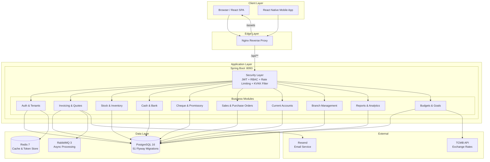

<p align="center">
  <h1 align="center">Zecrone - On Muhasebe</h1>
  <p align="center">
    <strong>Enterprise-Grade Multi-Tenant SaaS Accounting Platform</strong>
  </p>
  <p align="center">
    A comprehensive financial management system built for small and medium-sized businesses in Turkey, featuring multi-branch operations, inventory tracking, invoicing, check/promissory note lifecycle management, mobile companion app, and fine-grained role-based access control.
  </p>
  <p align="center">
    
    
    
    
    
    
    
  </p>
</p>

---

> **Note:** This is a showcase repository containing documentation and architecture details only. The source code is maintained in a private repository. Live at **zecrone.com**.

## Overview

Zecrone is a full-stack, multi-tenant SaaS accounting platform designed to handle the complete financial operations of Turkish SMBs. The system supports multi-branch operations with tenant-level data isolation, KVKK (Turkish GDPR) compliance, and a self-service trial registration flow.

### Key Metrics

| Metric | Value |
|--------|-------|
| **Web Pages** | 38 lazy-loaded page components |
| **Mobile Screens** | 40+ screens with offline support |
| **REST API Controllers** | 38 controllers under `/api/v1/*` |
| **JPA Entities** | 90+ domain entities |
| **Database Migrations** | 51 Flyway migrations (V1-V51) |
| **JPA Repositories** | 42 Spring Data repositories |
| **Permissions** | 30+ granular permission codes |
| **Automated Tests** | 167 passing (integration + unit) |

## Features

### Financial Management
| Module | Description |
|--------|-------------|
| **Dashboard & Analytics** | Real-time KPI cards (income, expenses, net balance), monthly bar charts, budget progress indicators, recent transactions, branch-filtered views, TCMB exchange rate auto-sync, stock and cheque alerts |
| **Cash & Bank Management** | Cash registers and bank accounts with full CRUD, transaction histories, balance tracking, inter-account transfers (cash-to-bank, cash-to-cash) |
| **Invoicing** | Sales and purchase invoices with line items, types (Standard, Return, Proforma), statuses (Draft, Sent, Paid, Overdue, Cancelled), auto-generated numbers (INV-YYYYMM-XXXX), partial payment tracking with payment history, payment auto-deduction from cash register or bank account |
| **Withholding Tax (Stopaj)** | Configurable withholding rate per invoice, auto-calculated withholding amount, net amount computation |
| **Quotes & Conversion** | Sales quote creation with auto-generated numbers (QUO-YYYYMM-NNNN), one-click conversion to invoice |
| **Cheque & Promissory Notes** | Both received and issued instruments, full lifecycle management (In Portfolio, Collected, Paid, Endorsed, Bounced, Returned), endorsement (ciro) to suppliers with endorsement history, guarantor tracking, protest status |
| **Current Accounts** | Customer and supplier current account transactions (debit/credit), balance calculation, statement generation with cumulative running balance, credit limit risk analysis |
| **Recurring Transactions** | Automated recurring income/expense entries with configurable frequency (daily, weekly, monthly, yearly), automatic processing of due transactions |
| **Budgets** | Category-based budget creation (weekly, monthly, yearly periods), budget progress tracking with actual spend calculated from transactions |
| **Sales Goals** | Sales target definition with periods, progress auto-calculation from actual sales data |
| **Exchange Rates** | Auto-sync from TCMB (Turkish Central Bank) XML feed, scheduled hourly sync, Spring Cache (Redis) backed, multi-currency invoice support (TRY, USD, EUR, GBP) |

### Commercial Operations
| Module | Description |
|--------|-------------|
| **Sales Orders** | Multi-product sales order creation, status tracking, one-click conversion to invoice |
| **Purchase Orders** | Purchase order management with multi-product forms |
| **Purchase Requests** | Purchase request workflow for approval processes |
| **Products & Services** | Product catalog with barcode, HES code, SKU, purchase/selling prices (VAT-included or excluded), hierarchical categories, product variants (color, size via variant attributes system), product types |
| **Customers** | Full CRM with credit limit, discount rate, payment terms, transaction history, current account statement, risk analysis, customer-specific price lists |
| **Suppliers** | Extended profiles (authorized person, tags, bank info), purchase history, current account statement, aging/performance reports |

### Stock & Inventory
| Module | Description |
|--------|-------------|
| **Branch-Level Stock** | Per-branch inventory balances with stock movement tracking (IN/OUT) |
| **Stock Counts** | Physical inventory count sessions with auto-fill from current stock, completion auto-reconciles differences as adjustments |
| **Warehouse Locations** | Rack/shelf location management within warehouses |
| **Lot/Serial Tracking** | Lot and serial number tracking per product |
| **Stock Alerts** | Minimum stock threshold alerts with notification system |
| **Stock Value Reports** | Cost vs. sale price analysis, potential profit calculations |
| **Inter-Branch Transfers** | Stock transfer between branches with transfer order management |

### Reports & Analytics
| Report | Description |
|--------|-------------|
| **Summary Report** | Income, expense, liquidity, and transaction count KPIs |
| **Profit & Loss** | Category-based income/expense breakdown |
| **Cash Flow** | Monthly in/out with cumulative balance visualization |
| **Customer Sales** | Paginated customer sales analysis |
| **Supplier Purchases** | Paginated supplier purchase analysis |
| **Aging Analysis** | Customer/supplier overdue buckets |
| **Balance Sheet** | Assets, liabilities, and equity overview |
| **Product Sales** | Per-product sales performance |
| **Stock Value** | Inventory valuation report |
| **Transaction List** | Filtered and paginated transaction report |

### SaaS & Platform Features
| Module | Description |
|--------|-------------|
| **Self-Service Trial Registration** | Company signup with 14-day trial, 5-user limit, auto-generated URL slug, welcome email via Resend, auto-login with JWT |
| **SuperAdmin Panel** | Tenant CRUD, license management (Starter/Professional/Enterprise plans), license duration extension, expiry monitoring (30-day alerts), plan downgrade with user count validation, platform-wide statistics |
| **Multi-Tenant Isolation** | TenantContext (ThreadLocal) from JWT, every query filtered by tenant_id, SuperAdmin tenant switching via X-Tenant-Id header |
| **KVKK Compliance** | SuperAdmin access filter blocks business data access across tenants, only allows administrative endpoints for cross-tenant operations |
| **Multi-Branch** | Branch management with branch-level user assignment, branch-filtered data views, inter-branch operations |
| **RBAC Authorization** | 6 roles (Super Admin, Admin, Manager, Cashier, Sales, Readonly), 30+ granular permission codes, enforced at API and UI levels |
| **i18n** | Turkish and English language support with localStorage persistence |
| **Dark/Light Theme** | Theme toggle with system preference detection |
| **E-Invoice Queue** | Invoice sending queued to RabbitMQ (e-fatura.send) for async processing |
| **Email Notifications** | Invoice email sending via Resend API |
| **Activity Logging** | User activity audit trail |

### Mobile Application
| Feature | Description |
|---------|-------------|
| **Full Feature Parity** | 40+ screens covering virtually all web features |
| **Offline Support** | SQLite local database with sync engine for customers, products, draft invoices |
| **Push Notifications** | Expo Notifications integration |
| **Offline Queue** | Network-aware sync queue with automatic reconnection |
| **Haptic Feedback** | Tactile feedback for key interactions |
| **EAS Build** | Expo Application Services configuration for iOS/Android builds |

## Tech Stack

### Backend
| Technology | Purpose |
|-----------|---------|
| **Java 21** | Runtime |
| **Spring Boot 3.5** | Application framework |
| **Spring Security + JWT (JJWT 0.12.6)** | Authentication & authorization (15-min access + 7-day refresh tokens) |
| **Spring Data JPA + Hibernate** | ORM & data access |
| **JdbcTemplate** | Complex SQL queries (reports, dashboards, multi-join) |
| **PostgreSQL 16** | Primary database |
| **Flyway 10.x** | Database migration management (51 migrations) |
| **Redis 7** | Token store, cache, password reset codes |
| **RabbitMQ 3** | Async message processing (e-invoice, reports, stock alerts) |
| **Resend SDK 3.1** | Transactional email (noreply@zecrone.com) |
| **SpringDoc OpenAPI 2.8** | API documentation (Swagger UI) |
| **Lombok 1.18** | Boilerplate reduction |
| **Spring Actuator + Prometheus** | Monitoring & metrics |

### Frontend (Web)
| Technology | Purpose |
|-----------|---------|
| **React 18.3** | UI framework |
| **TypeScript 5.6** | Type safety |
| **Vite 5.4** | Build tool & dev server |
| **React Router 7** | Client-side routing |
| **TanStack Query 5** | Server state management & caching |
| **Tailwind CSS 3.4** | Utility-first styling |
| **shadcn/ui (Radix UI)** | Component library |
| **React Hook Form + Zod** | Form handling & validation |
| **Recharts + Chart.js** | Data visualization |
| **Framer Motion** | Animations |
| **jsPDF + html2canvas** | PDF export |
| **@zxing/library** | Barcode scanning |

### Mobile
| Technology | Purpose |
|-----------|---------|
| **React Native 0.83** | Cross-platform mobile framework |
| **Expo 55** | Development & deployment platform |
| **Zustand + MMKV** | State management with persistent storage |
| **Expo SQLite** | Offline local database |
| **Expo Notifications** | Push notification support |
| **React Native Skia** | High-performance charts |
| **Axios** | HTTP client (shared API layer with web) |

### Infrastructure
| Technology | Purpose |
|-----------|---------|
| **Azure VM** | Cloud hosting (zecrone.com) |
| **Nginx** | Reverse proxy, SPA fallback, gzip compression, asset caching |
| **Systemd** | Backend JAR process management with graceful shutdown |
| **Docker + docker-compose** | Development environment (PostgreSQL + Redis + RabbitMQ) |
| **GitHub Actions** | CI/CD pipeline |

## Architecture

The application follows a **modular monolith** architecture with clear domain boundaries, designed for eventual migration to microservices if needed.



For a detailed architecture breakdown, see [ARCHITECTURE.md](./ARCHITECTURE.md).

## Security Model

### Authentication Flow
- **JWT-based** with access tokens (15 min) and refresh tokens (7 days)
- Access tokens carry: userId, username, roles, permissions, tenantId
- Token blacklisting on logout via Redis with TTL matching remaining token lifetime
- Refresh token rotation via dedicated TokenStoreService
- Password reset flow with 6-digit code, Redis-stored with 30-min TTL, single-use
- Legacy plaintext passwords auto-upgraded to BCrypt on first login

### Request Pipeline
```
Request → RateLimitFilter → JwtAuthFilter → SuperAdminAccessFilter → @PreAuthorize → Business Logic
```

### KVKK (Turkish GDPR) Compliance
When a SuperAdmin accesses a different tenant's context via X-Tenant-Id header, the system automatically blocks all business data endpoints. Only administrative endpoints (tenant management, user management, roles, auth) are permitted, preventing unauthorized access to tenant business data.

### RBAC Model

| Role | Scope |
|------|-------|
| **SUPER_ADMIN** | Platform-wide tenant and license management, cross-tenant admin operations |
| **ADMIN** | Full tenant access including user and role management |
| **MANAGER** | All business operations except user management |
| **CASHIER** | Cash registers, bank transactions, cheque operations |
| **SALES** | Sales orders, customer management, invoicing |
| **READONLY** | View-only access to all modules |

Permissions are enforced at both the API level (`@PreAuthorize`) and the UI level (`ProtectedRoute` + `useAuth()` hooks). Admins can customize which permissions each role has through the Role Management interface.

## Multi-Tenancy Architecture

The platform uses a **shared-database, shared-schema** multi-tenancy approach:

- Every business entity includes a `tenant_id` column
- `TenantContext` (ThreadLocal) is populated from the JWT `tenantId` claim on every request
- Every database query includes `WHERE tenant_id = ?` filtering
- SuperAdmin can switch tenant context using the `X-Tenant-Id` request header
- KVKK filter prevents SuperAdmin from accessing business data across tenants

### Licensing Model

| Plan | Max Users | Description |
|------|-----------|-------------|
| **TRIAL** | 5 | 14-day free trial with self-service registration |
| **STARTER** | 5 | Basic plan for small businesses |
| **PROFESSIONAL** | 15 | Mid-tier plan with full features |
| **ENTERPRISE** | 999 | Large organizations with unlimited features |

License expiry automatically blocks user login with an informative error. Plan downgrade validates current user count before allowing the change.

## Database Schema

The database schema evolves through **51 Flyway migrations** (V1 through V51), organized into the following domains:

### Core Tables
| Domain | Key Tables |
|--------|------------|
| **Multi-Tenancy** | tenants, app_users, roles, permissions, role_permissions, user_roles |
| **Branches** | branches, branch_users |
| **Products** | products, product_categories, product_types, variant_attributes, variant_attribute_values, brands |
| **Stock** | branch_stocks, stock_movements, stock_alerts, stock_counts, stock_count_items, product_lots, warehouse_locations |
| **Invoicing** | invoices, invoice_items, invoice_payments, invoice_status_history, quotes, quote_items |
| **Orders** | sales_orders, sales_order_items, purchase_orders, purchase_order_items, purchase_requests, purchase_request_items |
| **Cash & Bank** | cash_registers, cash_transactions, bank_accounts, bank_transactions |
| **Cheques** | cheques, check_events, ledger_entries |
| **Current Accounts** | customers, suppliers, current_account_transactions, current_account_categories, customer_price_lists |
| **Finance** | transactions, recurring_transactions, budgets, exchange_rates, payment_methods, categories |
| **Transfers** | branch_transfers, branch_transfer_items |
| **Platform** | sales_goals, financial_goals, tags, currencies, report_templates, saved_reports, user_activity_log |

## Business Logic Highlights

### Invoice Payment Accounting
When a payment is recorded against an invoice:
1. An `invoice_payments` record is created
2. If paid via cash register: the register balance is decremented and a cash transaction is recorded
3. If paid via bank account: the account balance is decremented and a bank transaction is recorded
4. A general `transactions` record is created for dashboard reporting
5. The invoice's paid amount, remaining amount, and status are recalculated automatically

### Stock Count Reconciliation
When a physical inventory count is completed, the system compares `counted_quantity` against `expected_quantity` for each item. Differences are automatically applied as stock adjustments to `branch_stocks`, keeping inventory records accurate without manual correction.

### Quote-to-Invoice Conversion
Quotes can be converted to invoices with a single action. All line items are copied to the new invoice, and the quote is linked via `converted_invoice_id` for traceability.

### Cheque Endorsement Chain
Received cheques can be endorsed (ciro) to suppliers, creating a complete endorsement history. Each endorsement records the target supplier, date, and notes, maintaining full traceability of the instrument's chain of custody.

### Recurring Transaction Processing
The system scans for due recurring transactions and automatically creates actual transaction records based on the configured frequency (daily, weekly, monthly, yearly), ensuring automated bookkeeping.

### Exchange Rate Integration
TCMB (Turkish Central Bank) XML feed is parsed at application startup and auto-synced every hour. Rates are cached in Redis for performance. All multi-currency invoices use these rates for conversion.

## Project Structure

```
zecrone/
├── backend/                    # Spring Boot backend (Java 21)
│   ├── src/main/java/.../
│   │   ├── api/                # 38 REST controllers
│   │   ├── domain/             # 90+ JPA entities + enums
│   │   ├── repository/         # 42 Spring Data repositories
│   │   ├── service/            # InvoiceService, CheckService, ExchangeRateService,
│   │   │                       # EmailService, AsyncJobService, ActivityLogService
│   │   ├── security/           # JWT, TenantContext, SuperAdminAccessFilter, RateLimitFilter
│   │   ├── config/             # SecurityConfig, WebConfig, RabbitMqConfig, DatabaseUrlConfig
│   │   └── shared/             # BaseEntity, PageResponse, BusinessException, GlobalExceptionHandler
│   └── src/main/resources/
│       └── db/migration/       # 51 Flyway migrations (V1-V51)
│
├── client/                     # React frontend (TypeScript + Vite)
│   └── src/
│       ├── api/                # 20 API modules (axios-based)
│       ├── components/         # 60+ UI components (shadcn/ui + custom)
│       ├── pages/              # 38 page components (lazy-loaded)
│       ├── hooks/              # use-toast, use-mobile, use-paginated-query
│       ├── lib/                # auth, api-client, i18n, permissions, currency
│       └── types/              # TypeScript definitions
│
├── mobile/                     # React Native mobile app (Expo 55)
│   └── src/
│       ├── screens/            # 40+ screens (full feature parity)
│       ├── navigation/         # 6 stack/tab navigators
│       ├── components/         # Charts, forms, UI, layout
│       ├── stores/             # Zustand stores (auth, app, offline)
│       ├── db/                 # SQLite offline models + sync engine
│       └── api/                # 21 API modules
│
├── deploy/                     # Azure deploy script + nginx config
├── docker-compose.yml          # Dev stack (PostgreSQL + Redis + RabbitMQ)
└── docs/                       # Documentation
```

## Testing

The project maintains **167 automated tests** using:

| Type | Technology | Scope |
|------|-----------|-------|
| **Integration Tests** | Testcontainers (PostgreSQL + RabbitMQ) | Full request lifecycle with real databases |
| **Controller Tests** | MockMvc + Spring Security Test | All major API endpoints |
| **Service Tests** | JUnit 5 + Mockito | AsyncJobService, ExchangeRateService, CheckService, InvoiceService |
| **Security Tests** | Spring Security Test | JwtService, TokenStoreService |

All tests are multi-tenancy aware and validate tenant isolation.

## API Overview

The platform exposes a comprehensive REST API under `/api/v1/` with 38 controllers. Key endpoint groups:

| Endpoint Group | Operations |
|---------------|------------|
| `/auth` | Login, trial registration, token refresh, logout, password reset |
| `/invoices` | CRUD, payments, status management, email sending, e-invoice queue |
| `/quotes` | CRUD, convert to invoice |
| `/customers`, `/suppliers` | CRUD, transaction history, balance, current account statement, risk analysis |
| `/products` | CRUD, categories, variants, attributes |
| `/sales-orders`, `/purchase-orders` | CRUD, status tracking, convert to invoice |
| `/cash-bank` | Cash register and bank account CRUD, transactions, transfers |
| `/cheques` | CRUD, status lifecycle, endorsement, endorsement history |
| `/current-accounts` | Transactions, balance, statement, risk analysis |
| `/stock` | Movements, counts, lots, alerts, warehouse locations |
| `/branches`, `/branch-transfers` | Branch CRUD, inter-branch stock transfers |
| `/reports` | Summary, P&L, cash flow, aging, balance sheet, product/customer/supplier reports |
| `/budgets`, `/sales-goals` | CRUD, progress tracking |
| `/admin/users`, `/admin/roles` | User management, role permission configuration |
| `/tenants` | SuperAdmin tenant/license management |
| `/exchange-rates` | View rates, manual TCMB sync |

Full API documentation available via Swagger UI at `/swagger-ui.html`.

## License

This project is proprietary software. All rights reserved.

## Contact

**Yavuzhan Kursun**
GitHub: [@yavuzhankursun](https://github.com/yavuzhankursun)
